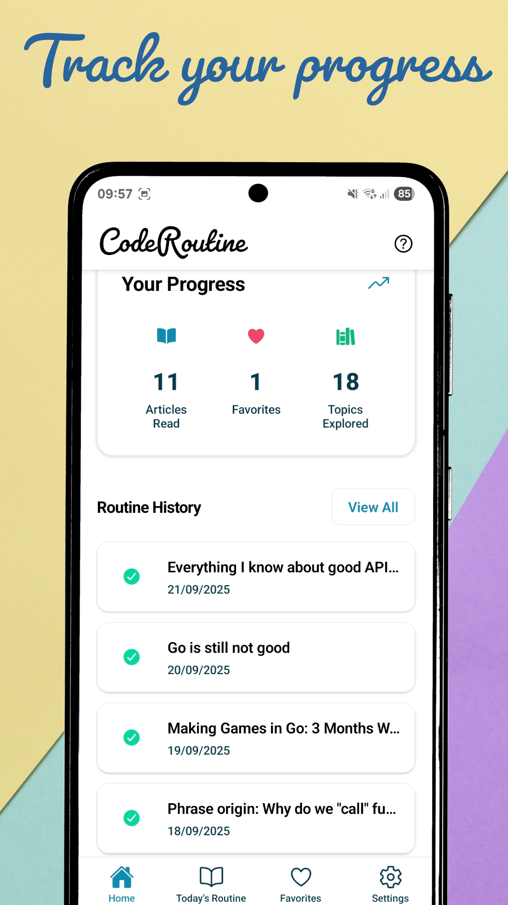
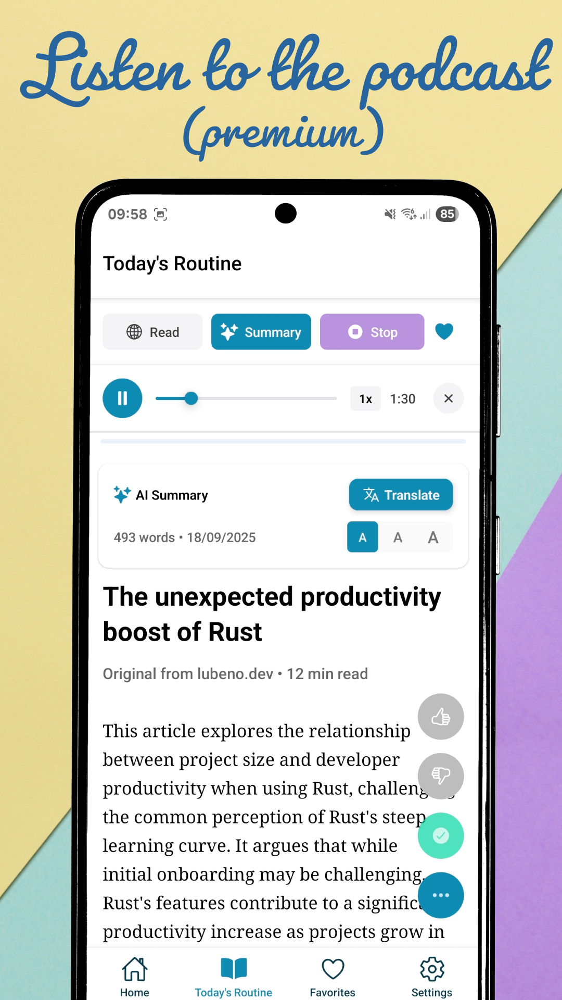

# CodeRoutine - Open Source

<p align="center">
  
  
  
  
  
</p>

> A beautifully crafted React Native app for building daily coding routines with articles, progress tracking, and community features.

## ✨ Features

- **📚 Daily Articles**: Curated coding articles delivered daily
- **📊 Progress Tracking**: Track reading streaks and learning progress
- **🔥 Reading Streaks**: Gamified learning experience
- **🌙 Dark/Light Theme**: Beautiful adaptive themes
- **📱 Offline Reading**: Read articles without internet connection
- **🔔 Push Notifications**: Stay notified about new content
- **🎧 Podcast Mode**: AI-generated audio versions of articles
- **🌍 Multi-language**: Support for multiple languages
- **⭐ Favorites**: Save articles for later reading
- **📈 Analytics**: Track your learning journey
- **💾 Local Storage**: All data stored locally with optional cloud sync
- **🔒 Privacy-First**: Your data stays on your device

## 📱 Screenshots

<p align="center">
  
  
  
  
</p>

<p align="center">
  
  
  
  
</p>

## 🏗️ Architecture

This app follows a clean architecture pattern with:

- **Frontend**: React Native with Expo
- **State Management**: React Context + Hooks
- **Local Storage**: AsyncStorage with structured data
- **Backend**: RESTful API (bring your own backend)
- **Database**: Compatible with any REST API backend
- **Authentication**: Token-based API access
- **Notifications**: Expo Push Notifications
- **Analytics**: Custom tracking system

## 🚀 Quick Start

### Prerequisites

- Node.js 18+
- npm or yarn
- Expo CLI (`npm install -g @expo/cli`)
- iOS Simulator (Mac) or Android Studio

### Installation

1. **Clone the repository**
```bash
git clone https://github.com/edodusi/coderoutine-oss.git
cd coderoutine-oss
```

2. **Install dependencies**
```bash
npm install
```

3. **Configure environment**
```bash
cp .env.example .env
# Edit .env with your configuration
```

4. **Start development server**
```bash
npx expo start
```

## ⚙️ Configuration

### Required Environment Variables

```bash
# API Configuration
EXPO_PUBLIC_API_BASE_URL=https://your-api-url.com
EXPO_PUBLIC_ACCESS_TOKEN=your-secure-access-token

# RevenueCat (Optional - for subscriptions)
EXPO_PUBLIC_REVENUECAT_APPLE_API_KEY=appl_your_key
EXPO_PUBLIC_REVENUECAT_GOOGLE_API_KEY=goog_your_key
```

### Backend Setup

This app is designed to work with any backend that implements the required API endpoints. You can:

1. **Use your existing API**
   - Implement the required endpoints (see API specification below)
   - Configure the base URL and authentication

2. **Build a simple backend**
   - Use any technology stack (Node.js, Python, PHP, etc.)
   - Implement the REST API endpoints
   - Store data in your preferred database

3. **Mock API for development**
   - Use tools like JSON Server or MSW
   - Perfect for testing and development

### API Endpoints Required

Your backend should implement these endpoints:

```
GET  /api/articles/today          # Get today's article
GET  /api/articles               # Get articles with pagination
GET  /api/articles/:id           # Get specific article
POST /api/analytics/read         # Track article reads
POST /api/articles/:id/vote      # Vote on articles
POST /api/notification/register  # Register for notifications
POST /api/notification/unregister # Unregister from notifications
```

### Example API Response Format

```json
// GET /api/articles/today
{
  "article": {
    "id": "article-123",
    "title": "Understanding React Hooks",
    "url": "https://example.com/article",
    "description": "Learn about React Hooks...",
    "routineDay": "2024-01-15",
    "estimatedReadTime": 8,
    "tags": ["react", "javascript", "hooks"],
    "author": "Jane Developer",
    "source": "Dev Blog"
  },
  "routineDay": "2024-01-15"
}
```

## 🛠️ Development

### Project Structure

```
src/
├── components/          # Reusable UI components
│   ├── common/         # Generic components
│   ├── navigation/     # Navigation components
│   └── onboarding/     # Onboarding flow
├── screens/            # Screen components
├── context/            # React Context providers
├── hooks/              # Custom React hooks
├── services/           # API and business logic
├── types/              # TypeScript type definitions
├── utils/              # Utility functions
├── config/             # Configuration files
└── test/               # Test utilities
```

### Key Technologies

- **React Native**: Cross-platform mobile development
- **Expo**: Development toolchain and platform
- **TypeScript**: Type-safe JavaScript
- **AsyncStorage**: Local data persistence
- **React Navigation**: Navigation system
- **Expo Notifications**: Push notifications
- **Vitest**: Testing framework

### Development Scripts

```bash
npm start                # Start Expo development server
npm run android         # Run on Android emulator
npm run ios             # Run on iOS simulator
npm run web             # Run in web browser
npm test                # Run tests
npm run test:watch      # Run tests in watch mode
npm run test:coverage   # Run tests with coverage
npm run lint            # Run ESLint
npm run type-check      # Run TypeScript compiler
```

## 🧪 Testing

The project includes comprehensive testing:

```bash
# Run all tests
npm test

# Run specific test file
npm test -- article.test.ts

# Run tests with coverage
npm run test:coverage

# Run tests in watch mode during development
npm run test:watch
```

### Test Coverage

- Unit tests for services and utilities
- Component testing for UI components
- Integration tests for user flows
- Storage and data persistence tests
- Onboarding flow tests

## 📦 Building & Deployment

### Development Build

```bash
# Create development build
eas build --platform android --profile development
eas build --platform ios --profile development
```

### Production Build

```bash
# Build for app stores
eas build --platform android --profile production
eas build --platform ios --profile production
```

### Local Development

For local development with Expo Go:

```bash
npx expo start
# Scan QR code with Expo Go app
```

## 🔧 Customization

### Theming

The app supports custom themes. Modify `src/context/ThemeContext.tsx`:

```typescript
const themes = {
  light: {
    colors: {
      primary: '#007AFF',
      background: '#FFFFFF',
      card: '#F2F2F7',
      text: '#000000',
      // ... your colors
    }
  },
  dark: {
    colors: {
      primary: '#0A84FF',
      background: '#000000',
      card: '#1C1C1E',
      text: '#FFFFFF',
      // ... dark theme colors
    }
  }
};
```

### Adding New Features

1. Create components in `src/components/`
2. Add screens in `src/screens/`
3. Update navigation in `src/components/Navigation.tsx`
4. Add types in `src/types/`
5. Write tests for new functionality

### Storage Customization

Modify storage behavior in `src/services/storageService.ts`:

```typescript
// Add new storage keys
const STORAGE_KEYS = {
  CUSTOM_DATA: 'custom_data',
  // ... existing keys
};

// Add new storage methods
async saveCustomData(data: CustomData): Promise<void> {
  // Implementation
}
```

## 🤝 Contributing

We welcome contributions! Please see [CONTRIBUTING.md](CONTRIBUTING.md) for details.

### Development Workflow

1. Fork the repository
2. Create a feature branch (`git checkout -b feature/amazing-feature`)
3. Make your changes
4. Add tests for new functionality
5. Ensure all tests pass (`npm test`)
6. Commit your changes (`git commit -m 'Add amazing feature'`)
7. Push to the branch (`git push origin feature/amazing-feature`)
8. Open a Pull Request

### Code Style

- Follow TypeScript best practices
- Use the provided ESLint configuration
- Write tests for new features
- Update documentation as needed
- Follow existing naming conventions

## 📊 Performance

### Optimization Features

- **Lazy Loading**: Components loaded on demand
- **Memoization**: React.memo and useMemo where appropriate
- **Efficient Re-renders**: Optimized state management
- **Image Optimization**: Cached images and assets
- **Bundle Optimization**: Optimized build output

### Performance Monitoring

Monitor app performance with:

- React DevTools
- Flipper integration (for debugging)
- Custom analytics tracking
- Error boundary implementations

## 🔒 Security & Privacy

### Data Protection

- All sensitive data stored securely
- No hardcoded secrets in source code
- Environment variable configuration
- Secure API communication (HTTPS only)
- Input
 validation and sanitization

### Privacy-First Design

- **Local-First**: All data stored locally by default
- **No Tracking**: No analytics without explicit consent
- **Optional Cloud Sync**: Users choose whether to sync data
- **Transparent**: Clear about what data is collected
- **User Control**: Users can delete all data anytime

## 📚 API Documentation

### Authentication

All API requests require an access token:

```typescript
headers: {
  'x-access-token': 'your-access-token',
  'Content-Type': 'application/json'
}
```

### Error Handling

API responses follow this format:

```typescript
// Success
{
  data: any,
  success: true
}

// Error
{
  error: "Error message",
  code: "ERROR_CODE",
  success: false
}
```

### Rate Limiting

Be mindful of rate limiting in your backend implementation:
- Implement appropriate rate limits per user/IP
- Return proper HTTP status codes (429 for rate limit exceeded)
- Include retry headers when applicable

## 🆘 Troubleshooting

### Common Issues

**"Access token not configured"**
- Copy `.env.example` to `.env`
- Set `EXPO_PUBLIC_ACCESS_TOKEN` in your `.env` file

**"Network request failed"**
- Check `EXPO_PUBLIC_API_BASE_URL` configuration
- Verify your backend is running and accessible
- Check device network connectivity

**Build failures**
- Clear Metro cache: `npx expo start --clear`
- Delete `node_modules` and reinstall: `rm -rf node_modules && npm install`
- Update Expo CLI: `npm install -g @expo/cli@latest`

**TypeScript errors**
- Run type checking: `npm run type-check`
- Check for missing type definitions
- Ensure all imports are correctly typed

### Getting Help

- Check the [Issues](https://github.com/edodusi/coderoutine-oss/issues) page
- Start a [Discussion](https://github.com/edodusi/coderoutine-oss/discussions)
- Review existing code for examples

## 🚀 Deployment Options

### Expo Application Services (EAS)

1. Install EAS CLI: `npm install -g eas-cli`
2. Configure: `eas build:configure`
3. Build: `eas build --platform all`

### Manual Build

1. Eject from Expo (if needed): `npx expo eject`
2. Follow standard React Native build process
3. Use Xcode (iOS) or Android Studio (Android)

### Web Deployment

1. Build for web: `npx expo export:web`
2. Deploy static files to any hosting service
3. Configure routing for SPA behavior

## 📄 License

This project is licensed under the MIT License - see the [LICENSE](LICENSE) file for details.

## 🙏 Acknowledgments

- **React Native Community**: For the amazing framework
- **Expo Team**: For excellent development tools
- **Open Source Contributors**: Everyone who has contributed
- **The Developer Community**: For inspiration and feedback

## 🔗 Links

- [Repository](https://github.com/edodusi/coderoutine-oss)
- [Issues](https://github.com/edodusi/coderoutine-oss/issues)
- [Discussions](https://github.com/edodusi/coderoutine-oss/discussions)

## 📈 Roadmap

- [ ] Web version optimization
- [ ] Enhanced offline capabilities
- [ ] Plugin system for custom backends
- [ ] Advanced theming system
- [ ] Accessibility improvements
- [ ] Performance optimizations
- [ ] Community features

---

<p align="center">
  Made with ❤️ by <a href="https://github.com/edodusi">Edoardo Dusi</a>
</p>

<p align="center">
  If this project helped you, please consider giving it a ⭐️
</p>
